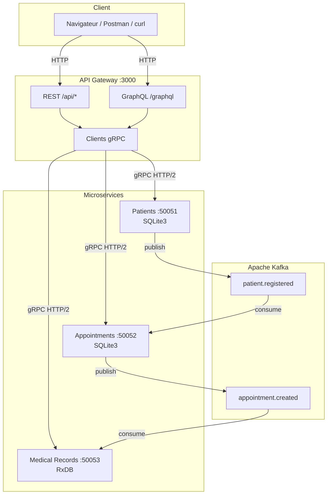

# Documentation Technique — Clinic Management System

> **Projet :** Système de gestion de clinique en microservices  
> **Auteur :** Emna Bouharb  
> **Cours :** SOA et Microservices — Dr. Salah Gontara — A.U. 2025-26  
> **Objectif :** Permettre à une personne externe de comprendre, installer et exécuter le projet.

---

## Table des matières

1. [Introduction](#1-introduction)
2. [Schéma d'architecture](#2-schéma-darchitecture)
3. [Structure du code source](#3-structure-du-code-source)
4. [gRPC et fichiers Protobuf](#4-grpc-et-fichiers-protobuf)
5. [Endpoints REST](#5-endpoints-rest)
6. [Schéma GraphQL](#6-schéma-graphql)
7. [Topics Kafka](#7-topics-kafka)
8. [Bases de données](#8-bases-de-données)
9. [Installation et exécution](#9-installation-et-exécution)
10. [Scénario de démonstration](#10-scénario-de-démonstration)

---

## 1. Introduction

### 1.1 Contexte métier

Le système permet de gérer le cycle de vie d'un patient dans une clinique :

1. **Inscription** du patient
2. **Prise de rendez-vous** avec un médecin
3. **Création automatique** d'un dossier médical (via Kafka)
4. **Consultation** : diagnostic, prescriptions, suivi

### 1.2 Choix architecturaux

| Décision | Justification |
|----------|---------------|
| **Microservices** | Séparation des responsabilités (patients, RDV, dossiers) |
| **gRPC inter-services** | Communication rapide, typée, contrats `.proto` stricts (HTTP/2 + Protobuf) |
| **REST + GraphQL côté client** | REST pour opérations simples ; GraphQL pour agrégation (`patientFullProfile`) |
| **Kafka** | Découplage asynchrone entre services (événements métier) |
| **SQLite3** | Données relationnelles structurées (patients, RDV) |
| **RxDB** | Documents JSON flexibles (dossiers médicaux avec prescriptions multiples) |
| **Docker Compose** | Déploiement reproductible en un seul commande |

### 1.3 Ports et services

| Service | Port | Protocole | Accès public |
|---------|------|-----------|--------------|
| API Gateway | 3000 | HTTP (REST + GraphQL) | Oui |
| Microservice Patients | 50051 | gRPC | Non (interne) |
| Microservice Appointments | 50052 | gRPC | Non (interne) |
| Microservice Medical Records | 50053 | gRPC | Non (interne) |
| Kafka | 9092 (host) / 29092 (Docker) | TCP | Non |
| Zookeeper | 2181 | TCP | Non |

---

## 2. Schéma d'architecture

### 2.1 Vue globale



### 2.2 Flux de communication

```
┌──────────────┐     HTTP REST/GraphQL      ┌──────────────┐
│    Client    │ ─────────────────────────► │  API Gateway │
└──────────────┘                            └──────┬───────┘
                                                   │ gRPC (HTTP/2 + Protobuf)
                     ┌─────────────────────────────┼─────────────────────────────┐
                     ▼                             ▼                             ▼
              ┌─────────────┐              ┌─────────────┐              ┌─────────────────┐
              │  Patients   │              │ Appointments│              │ Medical Records │
              │  SQLite3    │              │  SQLite3    │              │  RxDB (memory)  │
              └──────┬──────┘              └──────┬──────┘              └────────▲────────┘
                     │ publish                      │ publish                       │ consume
                     ▼                              ▼                               │
              patient.registered            appointment.created ──────────────────────┘
                     │                              │
                     └──────────► Kafka ◄────────────┘
```

### 2.3 Principe de l'API Gateway

Le client **n'accède jamais directement** aux microservices gRPC. L'API Gateway :

1. Reçoit une requête HTTP (REST ou GraphQL)
2. Traduit en appel gRPC via les clients (`api-gateway/grpc/*.js`)
3. Retourne la réponse en JSON au client

Variables d'environnement (Docker) :

| Variable | Valeur Docker | Valeur locale |
|----------|---------------|---------------|
| `PATIENTS_GRPC_HOST` | `microservice-patients:50051` | `localhost:50051` |
| `APPOINTMENTS_GRPC_HOST` | `microservice-appointments:50052` | `localhost:50052` |
| `MEDICAL_RECORDS_GRPC_HOST` | `microservice-medical-records:50053` | `localhost:50053` |

---

## 3. Structure du code source

```
clinic-microservices/
│
├── proto/                              # Contrats gRPC
│   ├── patient.proto
│   ├── appointment.proto
│   └── medical_record.proto
│
├── microservice-patients/
│   ├── index.js                        # Point d'entrée
│   ├── server.js                       # Serveur gRPC
│   ├── db.js                           # Initialisation SQLite3
│   ├── handlers/patientHandlers.js     # Logique métier + gestion erreurs gRPC
│   ├── kafka/producer.js               # Producteur Kafka
│   ├── Dockerfile
│   └── package.json
│
├── microservice-appointments/
│   ├── index.js
│   ├── server.js
│   ├── db.js
│   ├── handlers/appointmentHandlers.js
│   ├── kafka/producer.js               # Producteur Kafka
│   ├── kafka/consumer.js               # Consommateur Kafka
│   ├── Dockerfile
│   └── package.json
│
├── microservice-medical-records/
│   ├── index.js
│   ├── server.js
│   ├── db.js                           # Initialisation RxDB
│   ├── handlers/medicalRecordHandlers.js
│   ├── kafka/consumer.js               # Consommateur Kafka
│   ├── Dockerfile
│   └── package.json
│
├── api-gateway/
│   ├── index.js                        # Serveur Express
│   ├── routes/                         # Routes REST
│   │   ├── patients.js
│   │   ├── appointments.js
│   │   └── medicalRecords.js
│   ├── graphql/schema.js               # Schéma GraphQL + resolvers
│   ├── grpc/                           # Clients gRPC
│   │   ├── patientClient.js
│   │   ├── appointmentClient.js
│   │   └── medicalRecordClient.js
│   ├── Dockerfile
│   └── package.json
│
├── docker-compose.yml                  # Orchestration (6 services)
├── README.md
├── DOCUMENTATION_TECHNIQUE.md          # Ce document
└── GUIDE.md                            # Guide pratique utilisateur
```

---

## 4. gRPC et fichiers Protobuf


### 4.1 Principe

- **Protocol Buffers (`.proto`)** : définit les contrats (services, messages, types)
- **gRPC** : implémente ces contrats avec **HTTP/2** et sérialisation **Protobuf** (binaire, performant)
- Chaque microservice **expose** un serveur gRPC ; l'API Gateway **consomme** via des clients gRPC

### 4.2 Fichier `proto/patient.proto`

**Package :** `patient`  
**Service :** `PatientService`

| RPC | Request | Response | Description |
|-----|---------|----------|-------------|
| `CreatePatient` | `CreatePatientRequest` | `PatientResponse` | Créer un patient |
| `GetPatient` | `GetPatientRequest` | `PatientResponse` | Obtenir par ID |
| `UpdatePatient` | `UpdatePatientRequest` | `PatientResponse` | Modifier un patient |
| `DeletePatient` | `DeletePatientRequest` | `DeleteResponse` | Supprimer un patient |
| `ListPatients` | `ListPatientsRequest` | `ListPatientsResponse` | Liste paginée |
| `SearchPatients` | `SearchPatientsRequest` | `ListPatientsResponse` | Recherche par nom/email |

**Messages principaux :**

```protobuf
message PatientResponse {
  string id = 1;
  string firstName = 2;
  string lastName = 3;
  string dateOfBirth = 4;
  string gender = 5;
  string phone = 6;
  string email = 7;
  string address = 8;
  string bloodType = 9;
  string createdAt = 10;
}
```

**Gestion des erreurs gRPC :**

| Code gRPC | Constante | Cas d'usage |
|-----------|-----------|-------------|
| 3 | `INVALID_ARGUMENT` | firstName/lastName manquants |
| 5 | `NOT_FOUND` | Patient inexistant |
| 13 | `INTERNAL` | Erreur serveur / base de données |

### 4.3 Fichier `proto/appointment.proto`

**Package :** `appointment`  
**Service :** `AppointmentService`

| RPC | Request | Response | Description |
|-----|---------|----------|-------------|
| `CreateAppointment` | `CreateAppointmentRequest` | `AppointmentResponse` | Créer un RDV |
| `GetAppointment` | `GetAppointmentRequest` | `AppointmentResponse` | Obtenir par ID |
| `UpdateAppointmentStatus` | `UpdateStatusRequest` | `AppointmentResponse` | Changer statut |
| `ListAppointmentsByPatient` | `ListByPatientRequest` | `ListAppointmentsResponse` | RDV d'un patient |
| `ListAppointmentsByDoctor` | `ListByDoctorRequest` | `ListAppointmentsResponse` | RDV d'un médecin |
| `CancelAppointment` | `CancelRequest` | `DeleteResponse` | Annuler un RDV |

**Statuts valides :** `scheduled`, `completed`, `cancelled`

### 4.4 Fichier `proto/medical_record.proto`

**Package :** `medicalrecord`  
**Service :** `MedicalRecordService`

| RPC | Request | Response | Description |
|-----|---------|----------|-------------|
| `CreateRecord` | `CreateRecordRequest` | `RecordResponse` | Créer un dossier |
| `GetRecord` | `GetRecordRequest` | `RecordResponse` | Obtenir par ID |
| `GetRecordsByPatient` | `GetByPatientRequest` | `ListRecordsResponse` | Dossiers d'un patient |
| `AddPrescription` | `AddPrescriptionRequest` | `RecordResponse` | Ajouter prescription |
| `UpdateDiagnosis` | `UpdateDiagnosisRequest` | `RecordResponse` | Modifier diagnostic |

### 4.5 Implémentation gRPC

**Chargement du contrat (serveur et client) :**

```javascript
const grpc = require('@grpc/grpc-js');
const protoLoader = require('@grpc/proto-loader');

const packageDefinition = protoLoader.loadSync(PROTO_PATH, {
  keepCase: true,
  longs: String,
  enums: String,
  defaults: true,
  oneofs: true,
});
const patientProto = grpc.loadPackageDefinition(packageDefinition).patient;
```

**Serveur gRPC (exemple Patients) :**

```javascript
server.addService(patientProto.PatientService.service, {
  CreatePatient: handlers.createPatient,
  GetPatient: handlers.getPatient,
  // ...
});
server.bindAsync('0.0.0.0:50051', grpc.ServerCredentials.createInsecure(), callback);
```

**Client gRPC (API Gateway) :**

```javascript
const client = new patientProto.PatientService('microservice-patients:50051', grpc.credentials.createInsecure());
client.CreatePatient(request, (error, response) => { /* ... */ });
```

### 4.6 Cohérence contrat / logique métier

| Contrat `.proto` | Logique métier |
|------------------|----------------|
| `CreatePatientRequest.firstName` required | Validé dans `patientHandlers.js` |
| `UpdateStatusRequest.status` | Validé : `scheduled`, `completed`, `cancelled` |
| `CreateRecordRequest.patientId` required | Validé dans `medicalRecordHandlers.js` |
| `DeleteResponse` | Retourné par `DeletePatient`, `CancelAppointment` |

---

## 5. Endpoints REST
 
> **Base URL :** `http://localhost:3000`

### 5.1 Patients — `/api/patients`

| Méthode | Endpoint | Body (JSON) | Réponse | Description |
|---------|----------|-------------|---------|-------------|
| `POST` | `/api/patients` | `{ firstName*, lastName*, dateOfBirth, gender, phone, email, address, bloodType }` | `201` PatientResponse | Créer un patient |
| `GET` | `/api/patients` | — | `200` `{ patients[], total }` | Liste paginée (`?page=1&limit=10`) |
| `GET` | `/api/patients/search?q=` | — | `200` `{ patients[], total }` | Recherche |
| `GET` | `/api/patients/:id` | — | `200` Patient / `404` | Détail patient |
| `PUT` | `/api/patients/:id` | `{ firstName, lastName, phone, email, address }` | `200` Patient | Modifier |
| `DELETE` | `/api/patients/:id` | — | `200` `{ success, message }` | Supprimer |

**Exemple — Créer un patient :**

```http
POST /api/patients HTTP/1.1
Content-Type: application/json

{
  "firstName": "Mohamed",
  "lastName": "Ben Ali",
  "dateOfBirth": "1990-05-15",
  "gender": "M",
  "phone": "+216 20 123 456",
  "email": "mohamed@test.com",
  "bloodType": "A+"
}
```

### 5.2 Rendez-vous — `/api/appointments`

| Méthode | Endpoint | Body (JSON) | Réponse | Description |
|---------|----------|-------------|---------|-------------|
| `POST` | `/api/appointments` | `{ patientId*, doctorName*, specialty, dateTime*, reason }` | `201` Appointment | Créer RDV |
| `GET` | `/api/appointments/:id` | — | `200` Appointment / `404` | Détail RDV |
| `GET` | `/api/appointments/patient/:patientId` | — | `200` `{ appointments[] }` | RDV par patient |
| `GET` | `/api/appointments/doctor/:doctorName` | — | `200` `{ appointments[] }` | RDV par médecin |
| `PATCH` | `/api/appointments/:id/status` | `{ status* }` | `200` Appointment | Changer statut |
| `DELETE` | `/api/appointments/:id` | — | `200` `{ success, message }` | Annuler RDV |

**Exemple — Créer un RDV :**

```http
POST /api/appointments HTTP/1.1
Content-Type: application/json

{
  "patientId": "uuid-du-patient",
  "doctorName": "Dr. Trabelsi",
  "specialty": "Cardiologie",
  "dateTime": "2026-07-01T09:00:00.000Z",
  "reason": "Consultation"
}
```

### 5.3 Dossiers médicaux — `/api/records`

| Méthode | Endpoint | Body (JSON) | Réponse | Description |
|---------|----------|-------------|---------|-------------|
| `POST` | `/api/records` | `{ patientId*, appointmentId, doctorName, diagnosis, notes, prescriptions[] }` | `201` Record | Créer dossier |
| `GET` | `/api/records/:id` | — | `200` Record / `404` | Détail dossier |
| `GET` | `/api/records/patient/:patientId` | — | `200` `{ records[] }` | Dossiers patient |
| `PATCH` | `/api/records/:id/prescription` | `{ prescription* }` | `200` Record | Ajouter prescription |
| `PATCH` | `/api/records/:id/diagnosis` | `{ diagnosis* }` | `200` Record | Modifier diagnostic |

### 5.4 Codes HTTP utilisés

| Code | Signification |
|------|---------------|
| 200 | Succès |
| 201 | Ressource créée |
| 404 | Ressource non trouvée (gRPC NOT_FOUND) |
| 500 | Erreur serveur |

---

## 6. Schéma GraphQL

> **URL :** `http://localhost:3000/graphql`  
> **Interface :** GraphiQL intégré (playground interactif)

### 6.1 Justification de GraphQL

| REST | GraphQL |
|------|---------|
| Plusieurs requêtes pour un profil complet | **Une seule requête** `patientFullProfile` |
| Structure fixe par endpoint | Le client choisit les champs retournés |
| Adapté aux opérations CRUD simples | Adapté à l'**agrégation** multi-services |

**Cas d'usage principal :** un médecin consulte le profil complet d'un patient (infos + RDV + dossiers) en une requête.

### 6.2 Types GraphQL

```graphql
type Patient {
  id: ID
  firstName: String
  lastName: String
  dateOfBirth: String
  gender: String
  phone: String
  email: String
  address: String
  bloodType: String
  createdAt: String
}

type Appointment {
  id: ID
  patientId: String
  doctorName: String
  specialty: String
  dateTime: String
  reason: String
  status: String
  createdAt: String
}

type MedicalRecord {
  id: ID
  patientId: String
  appointmentId: String
  doctorName: String
  diagnosis: String
  notes: String
  prescriptions: [String]
  createdAt: String
  updatedAt: String
}

type PatientFullProfile {
  patient: Patient
  appointments: [Appointment]
  records: [MedicalRecord]
}

type DeleteResult { success: Boolean, message: String }
type PatientsList { patients: [Patient], total: Int }
```

### 6.3 Queries (lecture)

| Query | Arguments | Retour | Description |
|-------|-----------|--------|-------------|
| `patient` | `id: ID!` | `Patient` | Patient par ID |
| `patients` | `page, limit` | `PatientsList` | Liste paginée |
| `searchPatients` | `query: String!` | `PatientsList` | Recherche |
| `appointment` | `id: ID!` | `Appointment` | RDV par ID |
| `appointmentsByPatient` | `patientId: ID!` | `[Appointment]` | RDV d'un patient |
| `appointmentsByDoctor` | `doctorName: String!` | `[Appointment]` | RDV d'un médecin |
| `medicalRecord` | `id: ID!` | `MedicalRecord` | Dossier par ID |
| `recordsByPatient` | `patientId: ID!` | `[MedicalRecord]` | Dossiers patient |
| `patientFullProfile` | `patientId: ID!` | `PatientFullProfile` | **Profil agrégé** |

### 6.4 Mutations (écriture)

| Mutation | Arguments obligatoires | Retour |
|----------|------------------------|--------|
| `createPatient` | `firstName`, `lastName` | `Patient` |
| `updatePatient` | `id` | `Patient` |
| `deletePatient` | `id` | `DeleteResult` |
| `createAppointment` | `patientId`, `doctorName`, `dateTime` | `Appointment` |
| `updateAppointmentStatus` | `id`, `status` | `Appointment` |
| `cancelAppointment` | `id` | `DeleteResult` |
| `createMedicalRecord` | `patientId` | `MedicalRecord` |
| `addPrescription` | `recordId`, `prescription` | `MedicalRecord` |
| `updateDiagnosis` | `recordId`, `diagnosis` | `MedicalRecord` |

### 6.5 Exemple — Profil complet (Query principale)

```graphql
query {
  patientFullProfile(patientId: "VOTRE_PATIENT_ID") {
    patient {
      id
      firstName
      lastName
      bloodType
      email
    }
    appointments {
      id
      doctorName
      specialty
      status
      dateTime
    }
    records {
      id
      diagnosis
      notes
      prescriptions
    }
  }
}
```

### 6.6 Exemple — Créer un patient (Mutation)

```graphql
mutation {
  createPatient(
    firstName: "Fatma"
    lastName: "Saidi"
    email: "fatma@test.com"
    bloodType: "O+"
  ) {
    id
    firstName
    lastName
    createdAt
  }
}
```

### 6.7 Intégration technique

- Bibliothèque : `express-graphql` + `graphql`
- Fichier : `api-gateway/graphql/schema.js`
- Les resolvers appellent les **clients gRPC** (même couche que REST)
- `patientFullProfile` utilise `Promise.all` pour interroger les 3 microservices en parallèle

---

## 7. Topics Kafka

### 7.1 Rôle de Kafka dans le projet

Kafka assure la **communication asynchrone** et le **découplage** entre microservices. Un service publie un événement métier ; d'autres services réagissent sans appel direct.

### 7.2 Topic `patient.registered`

| Attribut | Valeur |
|----------|--------|
| **Producteur** | `microservice-patients` (`kafka/producer.js`) |
| **Consommateur** | `microservice-appointments` (`kafka/consumer.js`) |
| **Déclencheur** | Création d'un patient (`CreatePatient`) |
| **Group ID consommateur** | `appointment-service-group` |

**Format du message (JSON) :**

```json
{
  "patientId": "uuid",
  "firstName": "Mohamed",
  "lastName": "Ben Ali",
  "email": "mohamed@test.com",
  "phone": "+216 20 123 456",
  "timestamp": "2026-06-19T10:00:00.000Z"
}
```

**Effet métier :** le service Appointments est notifié qu'un nouveau patient est disponible pour la prise de rendez-vous (log informatif).

### 7.3 Topic `appointment.created`

| Attribut | Valeur |
|----------|--------|
| **Producteur** | `microservice-appointments` (`kafka/producer.js`) |
| **Consommateur** | `microservice-medical-records` (`kafka/consumer.js`) |
| **Déclencheur** | Création d'un RDV (`CreateAppointment`) |
| **Group ID consommateur** | `medical-records-service-group` |

**Format du message (JSON) :**

```json
{
  "appointmentId": "uuid",
  "patientId": "uuid",
  "doctorName": "Dr. Trabelsi",
  "specialty": "Cardiologie",
  "dateTime": "2026-07-01T09:00:00.000Z",
  "timestamp": "2026-06-19T10:00:00.000Z"
}
```

**Effet métier :** création **automatique** d'un dossier médical avec :
- `diagnosis: ""`
- `notes: "Dossier initialisé automatiquement."`
- `prescriptions: []`

### 7.4 Chaîne événementielle complète

```
CreatePatient → patient.registered → (Appointments notifié)
CreateAppointment → appointment.created → Dossier médical auto-créé
```

### 7.5 Configuration Kafka

| Paramètre | Valeur Docker |
|-----------|---------------|
| Broker (interne) | `kafka:29092` |
| Broker (host) | `localhost:9092` |
| Client library | KafkaJS |
| Auto-create topics | Activé |

### 7.6 Vérifier Kafka

```bash
docker ps                          # clinic-kafka doit être "healthy"
docker logs clinic-medical-records # "subscribed to appointment.created"
docker logs clinic-appointments    # "Published appointment.created for ..."
```

---

## 8. Bases de données

### 8.1 SQLite3 — Service Patients

| Attribut | Valeur |
|----------|--------|
| **Fichier** | `microservice-patients/patients.db` |
| **Librairie** | `better-sqlite3` |
| **Type** | Relationnel (SQL) |

**Table `patients` :**

| Colonne | Type | Contrainte |
|---------|------|------------|
| id | TEXT | PRIMARY KEY |
| firstName | TEXT | NOT NULL |
| lastName | TEXT | NOT NULL |
| dateOfBirth | TEXT | |
| gender | TEXT | |
| phone | TEXT | |
| email | TEXT | UNIQUE |
| address | TEXT | |
| bloodType | TEXT | |
| createdAt | TEXT | NOT NULL |

**Justification :** données structurées, relations simples, persistance fichier.

### 8.2 SQLite3 — Service Appointments

| Attribut | Valeur |
|----------|--------|
| **Fichier** | `microservice-appointments/appointments.db` |
| **Librairie** | `better-sqlite3` |

**Table `appointments` :**

| Colonne | Type | Contrainte |
|---------|------|------------|
| id | TEXT | PRIMARY KEY |
| patientId | TEXT | NOT NULL |
| doctorName | TEXT | NOT NULL |
| specialty | TEXT | |
| dateTime | TEXT | NOT NULL |
| reason | TEXT | |
| status | TEXT | DEFAULT 'scheduled' |
| createdAt | TEXT | NOT NULL |

### 8.3 RxDB — Service Medical Records

| Attribut | Valeur |
|----------|--------|
| **Nom base** | `clinic_records` |
| **Storage** | Memory (`rxdb/plugins/storage-memory`) |
| **Type** | Document (JSON) |

**Schéma document `medicalrecords` :**

| Champ | Type | Description |
|-------|------|-------------|
| id | string | Identifiant unique |
| patientId | string | Référence patient (required) |
| appointmentId | string | Référence RDV |
| doctorName | string | Nom du médecin |
| diagnosis | string | Diagnostic médical |
| notes | string | Notes cliniques |
| prescriptions | string[] | Liste de prescriptions |
| createdAt | string | Date création ISO |
| updatedAt | string | Date modification ISO |

**Justification :** structure flexible pour documents médicaux évolutifs (prescriptions multiples, notes longues).


### 8.4 Consulter les données

| Base | Méthode |
|------|---------|
| Patients | `GET /api/patients` ou DB Browser for SQLite |
| Appointments | `GET /api/appointments/patient/:id` |
| Medical Records | `GET /api/records/patient/:id` (pas de fichier) |

**Copier SQLite depuis Docker :**

```bash
docker cp clinic-patients:/app/microservice-patients/patients.db ./patients.db
docker cp clinic-appointments:/app/microservice-appointments/appointments.db ./appointments.db
```

---

## 9. Installation et exécution

### 9.1 Prérequis

| Outil | Version | Obligatoire |
|-------|---------|-------------|
| Docker Desktop | Latest | Recommandé |
| Docker Compose | v2+ | Inclus avec Docker Desktop |
| Node.js | 20 LTS | Optionnel (exécution locale) |
| Git | Latest | Pour cloner / GitHub |

### 9.2 Installation via Docker (recommandé)

```bash
# 1. Cloner le dépôt
git clone https://github.com/emna008/clinic-microservices.git
cd clinic-microservices

# 2. Démarrer tous les services
docker-compose up --build

# 3. Vérifier (nouveau terminal)
curl http://localhost:3000/
```

**Services démarrés :**

| Conteneur | Rôle |
|-----------|------|
| clinic-zookeeper | Coordination Kafka |
| clinic-kafka | Bus de messages |
| clinic-patients | Microservice Patients |
| clinic-appointments | Microservice RDV |
| clinic-medical-records | Microservice Dossiers |
| clinic-api-gateway | API Gateway |

**Arrêter :**

```bash
docker-compose down
```

### 9.3 Installation locale (sans Docker)

```bash
# Terminal 0 — Kafka seulement
docker-compose up zookeeper kafka -d

# Terminal 1
cd microservice-patients && npm install && npm start

# Terminal 2
cd microservice-appointments && npm install && npm start

# Terminal 3
cd microservice-medical-records && npm install && npm start

# Terminal 4
cd api-gateway && npm install && npm start
```

> **Windows :** `better-sqlite3` nécessite Node 20 LTS + Visual Studio Build Tools (C++), ou utiliser Docker.

### 9.4 Variables d'environnement

| Variable | Service | Défaut local | Docker |
|----------|---------|--------------|--------|
| `PORT` | Tous | 50051/50052/50053/3000 | Idem |
| `KAFKA_BROKER` | Microservices | `localhost:9092` | `kafka:29092` |
| `PATIENTS_GRPC_HOST` | API Gateway | `localhost:50051` | `microservice-patients:50051` |
| `APPOINTMENTS_GRPC_HOST` | API Gateway | `localhost:50052` | `microservice-appointments:50052` |
| `MEDICAL_RECORDS_GRPC_HOST` | API Gateway | `localhost:50053` | `microservice-medical-records:50053` |

### 9.5 Dépannage

| Problème | Solution |
|----------|----------|
| `ERR_CONNECTION_REFUSED` :3000 | Vérifier `docker ps`, relancer `docker-compose up --build` |
| Dossiers médicaux vides | Vérifier `clinic-kafka` est **healthy**, recréer un RDV |
| `npm install` échoue (node-gyp) | Utiliser Docker ou Node 20 LTS + Build Tools C++ |
| Kafka crash au démarrage | Vérifier config `KAFKA_LISTENERS` dans `docker-compose.yml` |

---

## 10. Scénario de démonstration

Scénario complet pour la soutenance (REST + Kafka + GraphQL) :

### Étape 1 — Créer un patient (REST)

```bash
POST http://localhost:3000/api/patients
→ Noter le patientId
→ Kafka publie patient.registered
```

### Étape 2 — Créer un rendez-vous (REST)

```bash
POST http://localhost:3000/api/appointments
→ Noter l'appointmentId
→ Kafka publie appointment.created
→ Dossier médical créé automatiquement (attendre 5 s)
```

### Étape 3 — Vérifier le dossier auto-créé (REST)

```bash
GET http://localhost:3000/api/records/patient/{patientId}
→ records[] non vide, notes = "Dossier initialisé automatiquement."
```

### Étape 4 — Enrichir le dossier (REST)

```bash
PATCH http://localhost:3000/api/records/{recordId}/diagnosis
Body: { "diagnosis": "Hypertension artérielle" }

PATCH http://localhost:3000/api/records/{recordId}/prescription
Body: { "prescription": "Amlodipine 5mg" }
```

### Étape 5 — Profil complet (GraphQL)

```graphql
query {
  patientFullProfile(patientId: "PATIENT_ID") {
    patient { firstName lastName bloodType }
    appointments { doctorName status dateTime }
    records { diagnosis prescriptions notes }
  }
}
```

---

## Références

- [gRPC Documentation](https://grpc.io/docs/)
- [Protocol Buffers](https://protobuf.dev/)
- [GraphQL](https://graphql.org/)
- [Apache Kafka](https://kafka.apache.org/)
- [RxDB](https://rxdb.info/)
- [Docker Compose](https://docs.docker.com/compose/)

---

*Document rédigé par Emna Bouharb — Clinic Management System — A.U. 2025-26*
